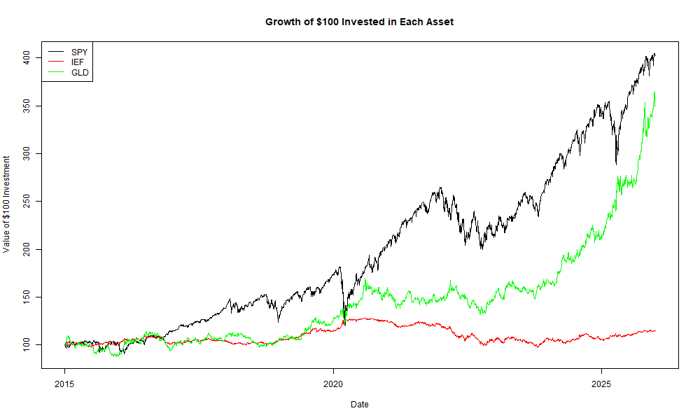
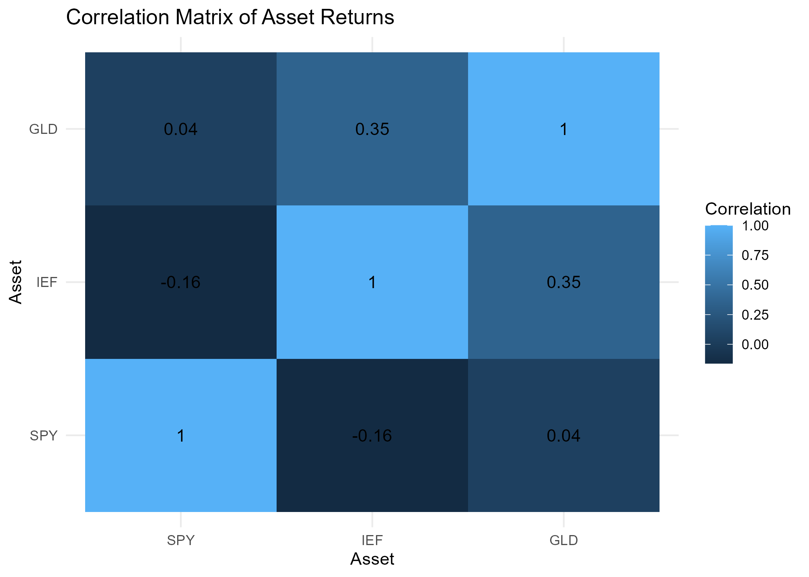
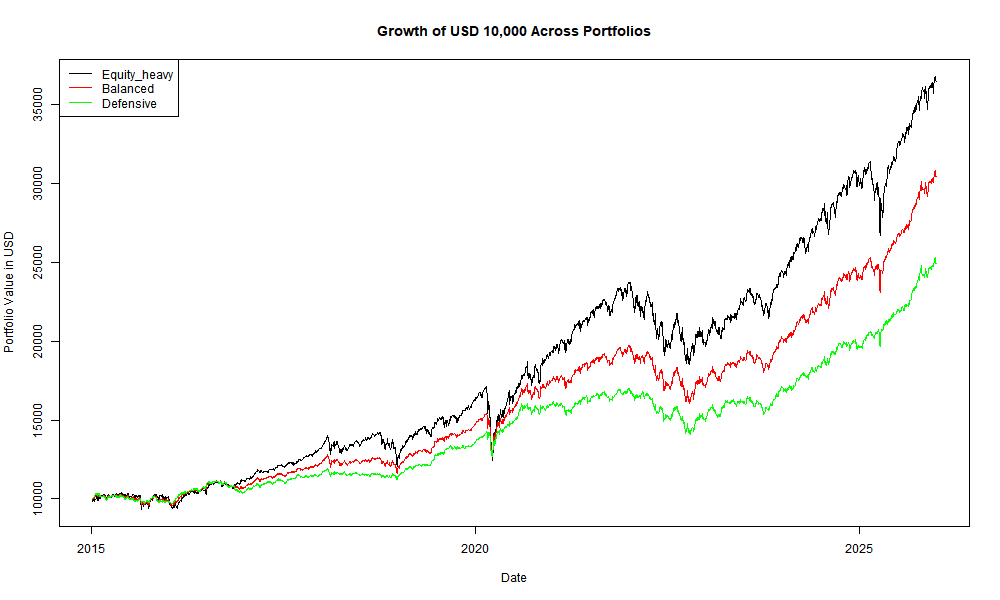
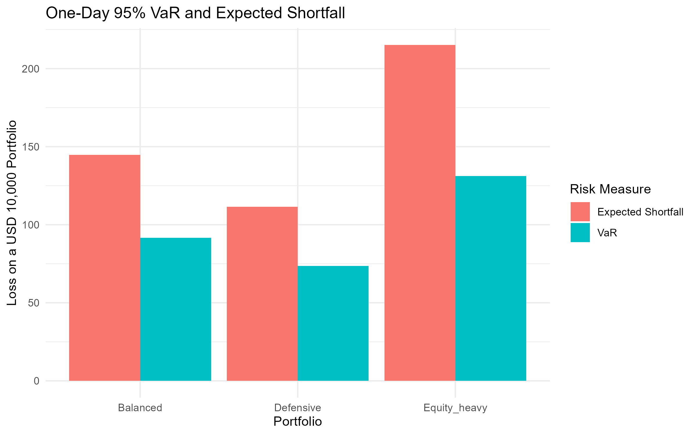
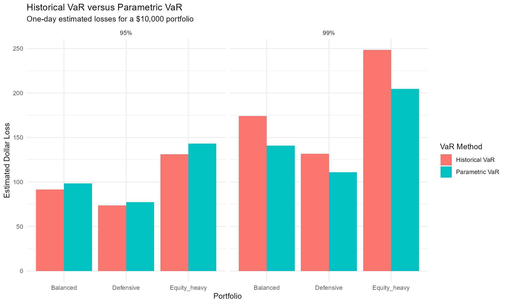
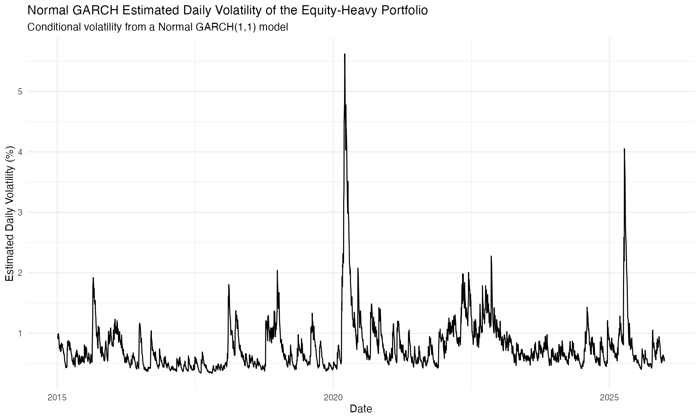
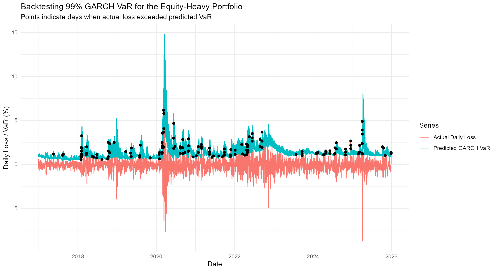
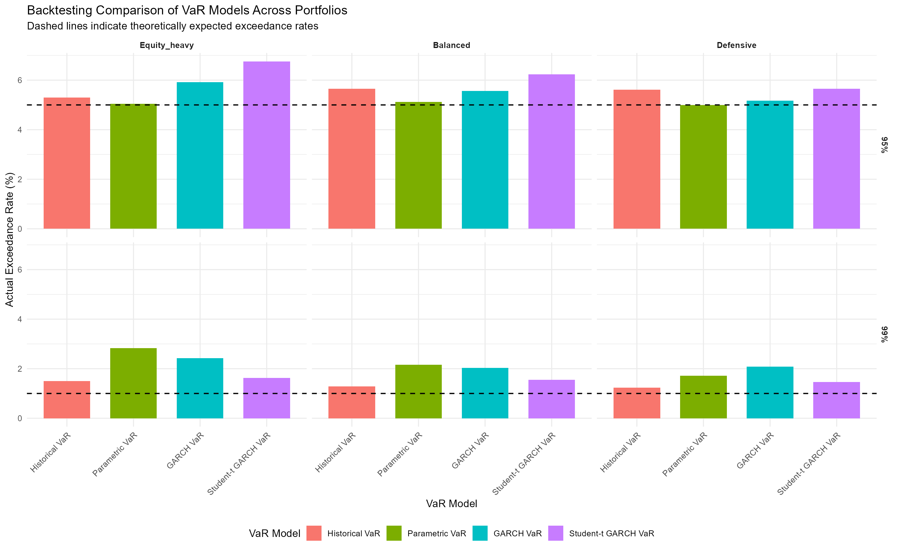

# Portfolio Risk Measurement and VaR Backtesting in R
## Does Diversification Protect Investors During Market Stress?

## Project Overview
This project examines whether combining equities, Treasury bonds and gold reduces portfolio risk using historical adjusted daily price data from 2015 to 2025.

Three fixed-weight portfolios with different levels of equity exposure are evaluated using compounded annualized return, annualized volatility, maximum drawdown, Value at Risk (VaR), Expected Shortfall and historical stress testing.

To assess how risk-model assumptions affect downside-risk estimation, the project compares Historical VaR, Parametric VaR, Normal GARCH VaR and Student-t GARCH VaR. Rolling one-day-ahead backtesting is then used to evaluate how closely each model's exceedance rates are to the theoretically expected rates.

## Research Questions
1. Does adding Treasury bond and gold exposure to an equity-heavy portfolio reduce volatility, drawdowns and tail losses?

2. How do different portfolio allocations affect the trade-off between long-term return and downside protection?

3. How do Historical VaR, Parametric VaR, Normal GARCH VaR and Student-t GARCH VaR differ in their estimates of downside risk?

4. How reliably do these VaR models forecast one-day-ahead portfolio losses in rolling backtesting?

5. Does diversification provide similar protection across different historical stress periods?

## Assets Analysed
- **SPY:** US equity market exposure
- **IEF:** Intermediate-term US Treasury bond exposure
- **GLD:** Gold exposure

## Portfolios Analysed
| Portfolio | SPY | IEF | GLD |
|---|---:|---:|---:|
| Equity-Heavy | 80% | 10% | 10% |
| Balanced | 50% | 25% | 25% |
| Defensive | 30% | 40% | 30% |

## Methods
- Daily return analysis
- Correlation analysis
- Portfolio construction
- Annualized return and volatility
- Maximum drawdown
- Historical Value at Risk
- Expected Shortfall
- Historical stress testing
- Comparison of historical Value at Risk and parametric Value at Risk 
- Exploratory assessment of the normal-return assumption using return distributions and QQ plots
- Rolling VaR Backtesting
- GARCH(1,1) conditional volatility modelling
- GARCH-based one-day-ahead VaR forecasting (following normal and Student-t distribution)
- Backtesting comparison of Historical VaR, Parametric VaR, Normal GARCH VaR, and Student-t GARCH VaR

## Tools Used
- R
- quantmod
- xts
- ggplot2
- PerformanceAnalytics
- rugarch

## Results and Key Findings
### 1. Individual Asset Behaviour and Diversification Potential
- SPY has the highest daily return and annualized return, but at the expense of the highest daily and thus annualized volatility. 

- Gold ranked between SPY and IEF for all four metrics while IEF is the last, showing lower returns but higher stability.
- Generally, there isn't a strong correlation (<= 0.35) between any two of the three assets, making them a compatible choice for portfolio diversification because the assets did not move together strongly over the observed period.

### 2. Portfolio Risk-Return Comparison
- the equity-heavy portfolio has the highest annualized return compared to other portfolios. This is possibly because equities, which bring higher returns according to the analysis above, occupy 80% of this portfolio.

- The equity-heavy portfolio, while being the most lucrative, has the highest volatility, possibly caused by the volatile nature of equities. 
- As the proportion of equities decreases, all three metrics, namely annualized compounded return, annualized volatility, and maximum drawdown, demonstrate a downward trend.
- Thus, lower equity exposure was associated with lower return, volatility and drawdown magnitude, highlighting the historical risk-return trade-off across the three portfolios. 

### 3. Downside Risk: VaR and Expected Shortfall
- In terms of VaR and expected shortfall, metrics used to assess the severity of potential or historically observed downside losses, the equity-heavy portfolio expectedly shows the worst performance. This means, investors who invest in this portfolio could suffer larger losses than those investing in other two.
- The Balanced and Defensive portfolios produced lower tail-risk estimates, suggesting that allocating more weight to bonds and gold reduced observed downside risk.
- Expected Shortfall complements VaR by showing the average severity of losses beyond the VaR threshold rather than only identifying the threshold itself.

### 4. Historical Stress Testing
- During COVID-19 sell off in 2020 and interest rate hike in 2022, the equity-heavy portfolio suffered the largest losses and deepest drawdowns compared to the other two.
- Reducing equity exposure was associated with smaller losses during both periods, although the protection provided by the Defensive portfolio was much stronger during the COVID-19 sell-off than during the 2022 inflation and rising-interest-rate environment.

| Portfolio | COVID-19 Return | COVID-19 Maximum Drawdown | 2022 Return | 2022 Maximum Drawdown |
|---|---:|---:|---:|---:|
| Equity-Heavy | -27.10% | -27.42% | -15.84% | -21.78% |
| Balanced | -16.97% | -17.38% | -12.61% | -18.39% |
| Defensive | -9.34% | -11.08% | -11.35% | -16.91% |

### 5. Historical VaR versus Parametric VaR
- Both VaRs rank the three portfolios the same way, so the equity-heavy portfolio is the highest in both VaRs, suggesting a greater estimated downside risk under both methods.
- Parametric VaR is higher at 95% confidence level, but lower at 99% confidence level. 
- The difference between the two methods became larger when moving from the 95% to the 99% confidence level, suggesting that distributional assumptions matter more when estimating more extreme downside losses.
- The past returns are not perfectly normally distributed, with longer tails on both sides.
- These results motivate the subsequent use of GARCH-based VaR models, including a Student-t specification, to examine whether modelling time-varying volatility and heavier tails improves downside-risk forecasting.

### 6. Rolling VaR Backtesting
- Rolling one-day-ahead backtesting was first applied to Historical VaR and Parametric VaR by comparing realized losses against predicted VaR thresholds.
- At both confidence levels, exceedance rates were compared with their theoretical benchmarks of 5% for 95% VaR and 1% for 99% VaR.
- The initial backtesting results motivated the later comparison with GARCH-based models, which explicitly model time-varying conditional volatility.

### 7. GARCH Conditional Volatility Modelling
- The GARCH(1,1) model estimates time-varying conditional volatility using past squared return shocks and previously estimated conditional variance. The resulting volatility path is used to assess whether predicted market risk rose during turbulent periods. 
- Unlike Historical VaR and Parametric VaR, which update risk estimates from a rolling sample of past returns or sample moments, GARCH models conditional volatility recursively using recent squared shocks and previously estimated variance. This allows it to respond explicitly to volatility clustering over time.

### 8. Normal GARCH one-day-ahead VaR forecasting
- Because estimated conditional volatility changes over time, Normal GARCH VaR produces a dynamic one-day-ahead loss threshold that responds to changing market risk.
- The detailed backtesting plot below illustrates how realized daily losses were compared with the predicted 99% Normal GARCH VaR threshold for the Equity-Heavy portfolio.

### 9. Backtesting Comparison of Four VaR Models
- At 99% confidence level, all models but Student-t GARCH VaR see a more noticeable deviation of exceedance rates from the expected rates across the observed portfolios. Parametric and Normal GARCH VaR perform particularly worse at this confidence level.
- At 95% however, Student-t GARCH VaR was less closely calibrated than some other simpler alternatives.
- Overall, increasing model complexity did not uniformly improve calibration across all portfolios and confidence levels.

## Overall conclusion
- Based on the observed historical sample, allocating greater weight to Treasury bonds and gold reduced portfolio volatility, drawdown magnitude and downside-risk estimates, although this came at the cost of lower long-term return.
- Diversification also reduced losses during both selected stress periods, but its protective effect was substantially stronger during the COVID-19 sell-off than during the 2022 inflation and rising-interest-rate environment.
- In the VaR backtesting analysis, model performance varied across confidence levels and portfolios. Historical VaR appeared more consistently calibrated across the observed combinations, while Parametric VaR was particularly competitive at 95% confidence level.
- Overall, the results suggest that both portfolio composition and model assumptions matter in risk management: diversification can reduce realized downside exposure, while increasingly sophisticated risk models do not automatically produce uniformly better forecasts.

## Limitations
1. This analysis uses historical data, and thus is not able to predict how the assets and the resulting portfolios will behave in future crises as correlations, returns and risk levels can change over time.
2. The selected ETFs are proxies of each asset classes not representative of all possible types of the asset.
3. The portfolios are all denominated in USD, not accounting for exchange rate movements between USD and the investor's home currency.
4. The fixed portfolio weights assume regular rebalancing. Different rebalancing frequencies may produce different risk and return outcomes.
5. The above calculations exclude transaction, management and other associated costs, which may become more material if portfolios are frequently rebalanced. Therefore, the report might overestimate realized investor returns.
6. VaR and Expected Shortfall are calculated based on historical returns, which rely on losses that have actually occurred. Therefore, a future crisis that is more severe or structurally different may not be captured adequately by these historical downside-risk estimates.
7. The selected historical stress periods do not represent every possible future crisis, thus the results of the stress testing may not accurately predict how the portfolios will perform under future crises.
8. The backtesting results may depend on selected rolling-window length, confidence levels and performance evaluation methods, not a comprehensive judgement of the ability of each VaR model.
9. The standard GARCH(1,1) specification assumes that positive and negative shocks of the same magnitude affect future volatility symmetrically, which may not fully reflect equity-market behaviour.
10. Normal GARCH VaR assumes normally distributed standardised shocks, while Student-t GARCH VaR represents only one possible heavy-tailed alternative. Model conclusions may differ under other distributional or asymmetric-volatility specifications.

## Reproducing the Analysis

Run the scripts in the following order:

1. `scripts/01_downloading_data.R`
2. `scripts/02_computing_returns.R`
3. `scripts/03_EDA.R`
4. `scripts/04_constructing_portfolios.R`
5. `scripts/05_analysis_of_portfolios.R`
6. `scripts/06_stress_testing.R`
7. `scripts/07_parametric_vs_historical_var.R`
8. `scripts/08_backtesting_of_VaRs.R`
9. `scripts/09_Normal_GARCH.R`
10. `scripts/10_normal_garch_backtesting.R`
11. `scripts/11_std_var_backtesting.R`

## Disclaimer

This project is conducted for educational and portfolio-development purposes only. It does not constitute investment advice.

## Full Report

A detailed written report is available here:

[View Full Report](report/Portfolio_Risk_Analysis_Report.pdf)